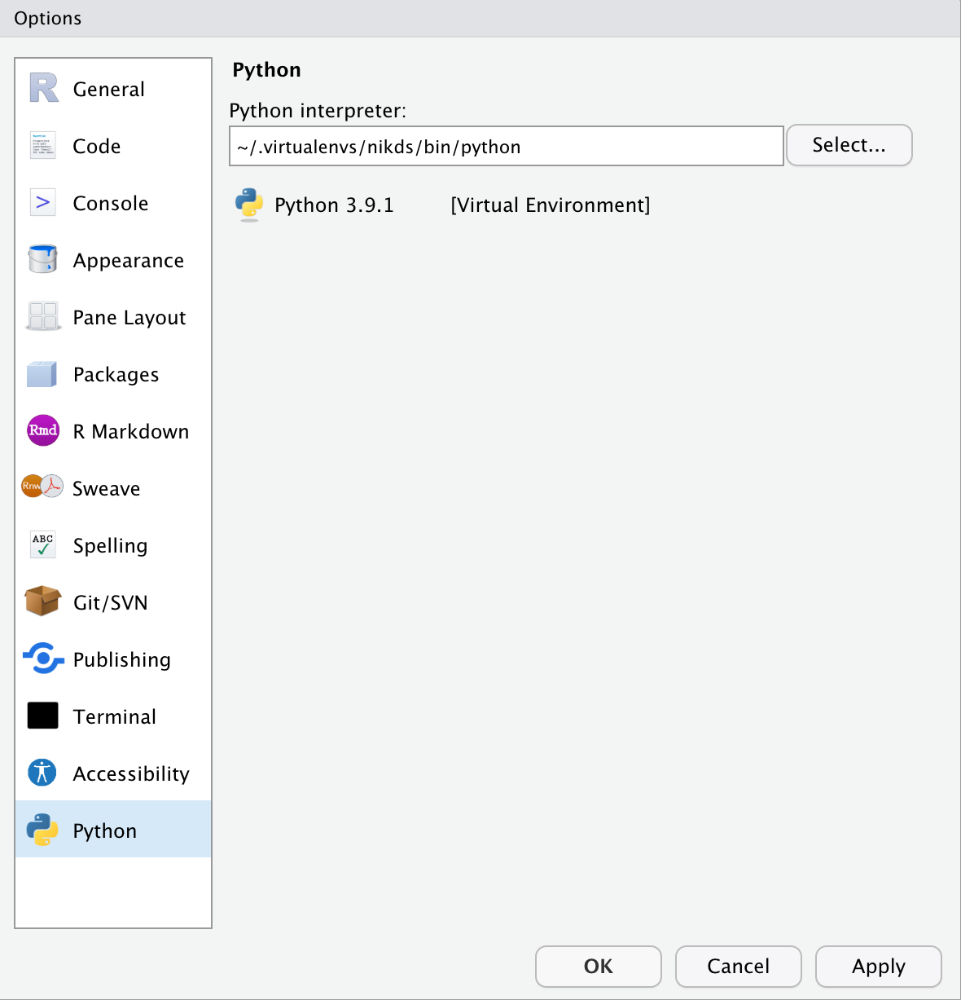

With the recent release of [RStudio 1.4](https://blog.rstudio.com/2021/01/19/announcing-rstudio-1-4/), I've taken a new look at coding in Python using the RStudio IDE and also using Python libraries through {reticulate}.

The {reticulate} package is a clever package that enables you to 'store' Python libraries and 'call' Python functions using familiar R syntax. My daily workflow consists of wrangling & analyzing data with R. Lately, however, I've found that the Scikit-Learn library in Python has a much better ability to parallelize machine learning more easily than any other package in R. In a nutshell, I find that parallelizaton of machine learning routines in R is heavily dependent on the package itself. Scikit-Learn is essentially an 'all-in-one' solution for model development, but it is not the most intuitive to use (as compared to using {tidymodels}).

Here's a high level workflow for me:

- R
  - data acquisition from database with
  - data wrangling and exploratory data analysis
  - 'tidy' and clean data exported to CSV

- Python
  - data preprocessing (e.g., balancing, train/test split)
  - data modeling (hypertuning) with Scikit-Learn
  - model scoring
  - note down best model parameters

- R
  - Apply best parameters to the appropriate model using the best package for the model (e.g., {ranger} for Random Forest)
  - Construct API with {plumber}
  - Deploy to production

This current workflow 'forces' me to rely on two different IDEs: RStudio for R and VSCode for Python. Prior to RStudio 1.4, it was difficult for me to know what objects were loaded into memory in the Environment tab as well as running Python scripts natively.

While {reticulate} was great to use before RStudio 1.4, I still had to debug in VSCode any errors found with Python calls. Now with RStudio 1.4, I can do it all in one IDE.

## TL;DR

This is a LONG post. You can find all the code used on my [GitHub as a gist](https://gist.github.com/nikdata/ce4c72550f184e6bc20d6c98475e5a5d). This code will walk you through how I use {reticulate} effectively (i.e., combining the best of R and Python in one script).

## Pre-Requisites

- RStudio 1.4
- {tidyverse}
- {reticulate}
- {palmerpenguins}
- Python 3.8 or higher with virtual environments
- working knowledge of Python (I don't talk much about Python decoding in this tutorial)

For this tutorial, I am assuming that you have already configured a particular virtual environment within the Global Options (or Project Options) menu.



One perk of using RStudio 1.4 is the fact that you no longer have to define the virtual environment in your R script once it is defined in the Global Options menu. However, you will need to do so if you wish to use a different virtual environment than the one in your Global Options (or Project Options) menu.

### Penguins!!

As you may have guessed, I'll be using the {palmerpenguins} package for the underlying data. The dataset within this package is far newer than the venerable iris dataset.

The objective is to predict the species of the penguin.

### Before we start

I want you to keep in mind that this is a simple tutorial. I'm not trying to optimize the machine learning algorithm nor am I trying to code in the most efficient/concise manner. Rather, I'd like to ensure that the steps are easy to understand and follow along. As you apply these techniques in your own project, please feel free to optimize as needed.

## Let's get started!

Let's load the R libraries:

```{r load_R_libraries, message=FALSE}
library(reticulate)
library(palmerpenguins)
library(dplyr)
library(ggplot2)
library(extrafont)
library(tidyr)
```

And now let's load the appropriate Python libraries:

```{r load_python_libraries}
pysmote_over <- reticulate::import('imblearn.over_sampling')
pysmote_under <- reticulate::import('imblearn.under_sampling')
pysmote_pipe <- reticulate::import('imblearn.pipeline')

sklearn_modelselection <- reticulate::import('sklearn.model_selection')
sklearn_ensemble <- reticulate::import('sklearn.ensemble')
sklearn_metrics <- reticulate::import('sklearn.metrics')
```

Now let's load the dataset (we'll store in a dataframe called `df_pgs` for conciseness) and explore it.

```{r data_load}
df_pgs <- palmerpenguins::penguins

dplyr::glimpse(df_pgs)
```

The data are encoded correctly if we wanted to build our model in R. For instance, the categorical columns are already encoded as factors. However, we need to remember that Scikit-Learn does not accept character values. Rather, these must be encoded as numerical values (either ordinally, dummy-encoded, or one-hot encoding). And we'll do that when we get building a 'recipe'.

### Data Exploration - Missing Values

One of the first things I like to do is identify if any columns have missing values.

```{r missing_val_check, message=FALSE}
df_pgs %>%
  purrr::map_df(function(x) sum(is.na(x))) %>%
  tidyr::pivot_longer(names_to = 'variable', cols = everything(), values_to = 'number_missing') %>%
  dplyr::arrange(desc(number_missing))
```

Looks like 5 of the 8 columns have missing values. In fact, the column `sex` has 11 missing values. While it may be tempting to remove the missing values, I have found that 'categorizing' missing values in their own category can be 'predictive' in itself. Furthermore, numerical values can be imputed with a variety of methods. We'll explore the imputing method more when we get to recipes.

### Data Exploration - Unique Values

For our variables encoded as factors, let's find out how many unique values we have. This will help us identify if it is necessary (or advisable) to group the categorizations for improved performance.

```{r unique_value_chk}
df_pgs %>%
  dplyr::select_if(is.factor) %>%
  purrr::map_df(function(x) n_distinct(x))
```
This is nice! We don't have too many unique values. In fact, the column `sex` has 3 unique values because the third value happens to be NA (which is 'unknown').

### Data Exploration - Check for Balance

A key check is to ensure that the response variable is balanced (especially in a multi-classification problem).

```{r balance_chk}
df_pgs %>%
  dplyr::group_by(species) %>%
  count()
```
And here we can see that there is a fairly large imbalance between the species Chinstrap and the other species. It'll probably be a good idea to go ahead and balance the data. And we'll do this balancing using the library imblearn in Python!

### Data Exploration - Visual Charts

Let's switch gears and take a look at some visual charts. First up: let's compare `bill` dimensions by species.

```{r chart1, message=FALSE}
df_pgs %>%
  ggplot(aes(x = bill_length_mm, y = bill_depth_mm)) +
  geom_point(aes(color = species)) +
  scale_x_continuous(limits = c(30,60)) +
  scale_y_continuous(limits = c(12,22), breaks = seq(12,22,2)) +
  labs(x = "Bill Length (mm)", 
       y = "Bill Depth (mm)", 
       color = "Species",
       title = "Bill Depth vs Length",
       caption = "Source: {palmerpenguins} package") +
  theme(plot.title = element_text(family = "Bahnschrift", color = 'grey100'),
        plot.caption = element_text(family = "Bahnschrift", color = 'grey60'),
        axis.title = element_text(family = 'Bahnschrift', color = 'grey100'),
        axis.text.x = element_text(family = "Bahnschrift", color = 'grey70'),
        axis.text.y = element_text(family = "Bahnschrift", color = 'grey70'),
        plot.background = element_rect(fill = 'grey10'),
        panel.background = element_blank(),
        panel.grid.major = element_line(color = 'grey30', size = 0.2),
        panel.grid.minor = element_line(color = 'grey30', size = 0.2),
        legend.background =  element_rect(fill = 'grey20'),
        legend.key = element_blank(),
        legend.title = element_text(family = 'Bahnschrift', color = 'grey80'),
        legend.text = element_text(family = "Bahnschrift", color = 'grey90'),
        legend.position = c(0.9, 0.2)
  )
```

I have to admit that there is some really clear separation between the three groups. In the real world, this doesn't happen often.

Some key takeaways from this chart:

- The Adelie species tends to have shallower bill length however with greater bill depth.
- The Chinstrap species seems to be almost a 'larger' version of the Gentoo species. They have roughly the same range in bill length, but the Chinstraps have larger bill depths.

So let's take a look at the weights of these species by gender.

```{r chart2, message=FALSE}

df_pgs %>%
  ggplot(aes(x = sex, y = body_mass_g)) +
  geom_boxplot(aes(fill = species), color = 'steelblue') +
  labs(x = "Sex", 
       y = "Body Mass (grams)", 
       title = "Body Mass of Species by Sex", 
       caption = 'Source: {palmerpenguins} package') +
  theme(plot.title = element_text(family = "Bahnschrift", color = 'grey100'),
        plot.caption = element_text(family = "Bahnschrift", color = 'grey60'),
        axis.title = element_text(family = 'Bahnschrift', color = 'grey100'),
        axis.text.x = element_text(family = "Bahnschrift", color = 'grey70'),
        axis.text.y = element_text(family = "Bahnschrift", color = 'grey70'),
        plot.background = element_rect(fill = 'grey10'),
        panel.background = element_blank(),
        panel.grid.major = element_line(color = 'grey30', size = 0.2),
        panel.grid.minor = element_line(color = 'grey30', size = 0.2),
        legend.background =  element_rect(fill = 'grey20'),
        legend.key = element_blank(),
        legend.title = element_text(family = 'Bahnschrift', color = 'grey80'),
        legend.text = element_text(family = "Bahnschrift", color = 'grey90'),
        legend.position = c(0.90, 0.9)
  )

```

Now this is interesting. The Gentoo species tends to be heavier than the other species for both genders. Interestingly, you'll notice the NA category for `Sex`. Visually speaking, it appears that the missing values can be imputed with the appropriate gender based on weight. However, for this tutorial, we'll call this column "unknown".

### Data Pre-Processing

Before we go any deeper, it's probably a good idea to split the data into a 'training' and test' group. This will enable us to assess the performance of any machine learning algorithm.

```{r data_split, message=FALSE}

set.seed(1337)
pg_split <- rsample::initial_split(df_pgs, prop = 0.75)
pg_train <- rsample::training(pg_split)
pg_test <- rsample::testing(pg_split)

```

#### Recipes!!!

Another intuitive tool within R is the ability to use the {recipes} package. Remarkably, this package enables you to create a step-by-step instruction on what to process for any dataframe that's passed through it. While you can do similar things with Scikit-Learn, it's just not as clean/crisp looking nor as intuitive. Don't bother disputing me since you won't convince me :) !

```{r define_recipe, message=FALSE}
base_recipe <- recipes::recipe(species ~ ., data = pg_train) %>%
  recipes::step_mutate(tmp_species = species) %>%
  recipes::step_meanimpute(bill_length_mm, bill_depth_mm, flipper_length_mm, body_mass_g, id = 'impute_missing_continuous') %>%
  recipes::step_factor2string(sex) %>%
  recipes::step_mutate(sex = ifelse(is.na(sex),'unknown',sex)) %>%
  recipes::step_string2factor(sex, levels = c('male','female','unknown')) %>%
  recipes::step_dummy(sex, one_hot = TRUE, levels = c('male','female','unknown'), preserve = TRUE) %>%
  recipes::step_integer(species, strict = TRUE, id = 'label encode response variable') %>%
  recipes::step_dummy(island, id = 'sparse encoding of islad variable', one_hot = TRUE, levels = c('Biscoe','Dream','Torgersen'), preserve = TRUE) %>%
  recipes::prep(training = pg_train)

base_recipe
```

There's quite a bit going on, so let me help you decode it:

1. I'm creating a new column called tmp_species so that I can preserve the 'character string'  as it will be encoded as integers. This is more of a convenience thing as it will enable me to have a 'decoder'.
2. I'm imputing all missing values in continuous variables with the mean.
3. I'm converting the values in column `sex` to a string so that I can more easily replace the NA values with 'unknown'. Once that's done, I convert it back to factors with the new level of 'unknown' and no more missing values.
4. Since `sex` is a column with character values, I need to convert it to a sparse matrix for each potential value. Again, this is necessary for handling categorical values in Scikit-Learn.
5. As previously mentioned, I then label encode each species (replacing the character string with a number). gain, this is necessary for handling categorical values in Scikit-Learn.
6. And I finally construct a sparse matrix for the `island` column as well.

Since we're using training data, the imputed value used in the training data will be the same value used in the test data.

To 'build' our modeling ready datasets, we need to 'juice' the training data and 'bake' the recipe to get the test data cleaned up. "Juicing" and "Baking" are taxonomies used in the {recipes} package to apply the recipe to datasets.

```{r uice_bake}
cln_train <- recipes::juice(base_recipe)
cln_test <- recipes::bake(base_recipe, pg_test)
```

Let's verify that we have no more missing data in either the training or test datasets.

```{r verify_trainjuice}
cln_train %>%
  purrr::map_df(function(x) sum(is.na(x))) %>%
  tidyr::pivot_longer(names_to = 'variable', cols = everything(), values_to = 'number_missing')
```
```{r verify_testjuice}
cln_test %>%
  purrr::map_df(function(x) sum(is.na(x))) %>%
  tidyr::pivot_longer(names_to = 'variable', cols = everything(), values_to = 'number_missing')
```
Note how we have no more missing values!

#### Balancing Act

Let's check to see our class imbalance in the derived training dataframe.

```{r imbal_chk}
cln_train %>%
  group_by(tmp_species) %>%
  count()
```

Notice how we don't have comparable observations for each class. It is good practice to have a balanced dataset. However, such is not the case in life at times. Often, we can either up-sample or just down-sample. However, these fundamental approaches are not always effective. One of the techniques I use is [SMOTE](https://bmcbioinformatics.biomedcentral.com/articles/10.1186/1471-2105-14-106). I find SMOTE to be fairly well performing and it is my go to approach. I also find using SMOTE in Python easier than in R.

Let's touch base on a couple of nuances regarding many Python libraries:

- Many of them expect numerical values only. So you need to ensure that your data are encoded correctly.
- Many parameters/arguments expect integers. When using {reticulate}, you should explicitly specify integers with an "L" at the end (e.g., 2L).

```{r pysmote}
# step 1: define the amount of samples desired
over <- pysmote_over$SMOTE(sampling_strategy = reticulate::dict('Chinstrap' = 100L, 'Gentoo' = 100L), random_state = 1337L)
under <- pysmote_under$RandomUnderSampler(sampling_strategy = reticulate::dict('Adelie' = 100L), random_state = 1234L)

# step 2: define pipeline (similar to recipes in R) to under and over sample in one go
steps <- list(c('o', over), c('u', under))
pipeline <- pysmote_pipe$Pipeline(steps = steps)

# step 3: do the actual resampling
df_rebal <- pipeline$fit_resample(X = cln_train %>% select(-tmp_species, -island, -sex), y = cln_train %>% select(tmp_species))

# step 4: extract the two different results and combine into one
nb_pred <- as_tibble(df_rebal[[1]])
nb_resp <- as_tibble(df_rebal[[2]])

cln_bal <- bind_cols(nb_resp, nb_pred)
```

So let's unpack what I'm doing:

1. I'm defining the amount of samples I want for each class explicitly. In this instance, the actual arguments require a dictionary (key,value pair) for the specific classes. In this case, it's far more easier to refer to them by name rather than the integer label encoding done prior. In this case, we are asking for 100 observations for each class. If the class has more than 100 samples already (such as Adelie), we will randomly under-sample. And vice-versa for the other classes.

2. The SMOTE pipeline allows me to 'daisy chain' commands together so it can all run in one go. This is similar to the recipes concept.

3. This is the step that executes the SMOTE algorithm on the supplied dataframe. Here is where {reticulate} shines as it 'transcodes' the R dataframe into something Python will understand. This step will return 2 dataframes: one for the predictors and the other for the response variable.

4. Since we get back two distinct dataframes from the `fit_resample()` function, I convert them to a tibble and combine them together.

Now let's see how many of each species we have in this new dataframe.

```{r rebal_chk}
cln_bal %>%
  group_by(tmp_species) %>%
  count()
```

Now that looks amazing (and balanced)!

### Model Development & Scoring

To keep the overall post somewhat short (I'm already failing), I'll only build a hyperparameter tuned Random Forest model. Nothing fancy, but just something to show how scikit-learn can be used with {reticulate}.

First up, we define the hyperparameter tuning grid.

```{r hyperparameter_grid}
param_grid <- reticulate::dict('bootstrap' = list(TRUE),
                               'max_depth' = seq(1L,4L,1L),
                               'max_features' = seq(2L,6L,1L),
                               'min_samples_split' = seq(2L,5L,1L),
                               'n_estimators' = c(250L, 500L))
```

Notice how I'm able to use a base R function `seq()` within a Python argument. Another beautiful feature of {reticulate}!

One nuance of Scikit-Learn is the fact that you have initialize a potential model engine. This is very much similar to the process found in {parsnip}.

```{r initiate_model}
rf_mdl <- sklearn_ensemble$RandomForestClassifier()

grid_search <- sklearn_modelselection$GridSearchCV(estimator = rf_mdl,
                                                   param_grid = param_grid,
                                                   cv = 5L,
                                                   n_jobs = -1L,
                                                   verbose = 0L,
                                                   scoring = 'accuracy',
                                                   refit = TRUE)

```

In the code block above, I've identified the cross validation steps after initializing the model engine. Similar to how workflows work as part of {tidymodels}, all of this has been 'stored' in memory, but not actually executed. We have to 'fit' this engine to get the actual results.

```{r run_engine}
grid_search$fit(X = cln_bal %>% select(-tmp_species, -species), y = cln_bal$species)
```

One aspect of model fitting that doesn't sit well with me is the fact that when models are fitted, you don't have a visual insight on storing the model results. For instance, there is no `<-` or `=` in the code block above. However, as that line runs, it will automatically store the results within `grid_search`.

Let's see what the best parameters are.

```{r best_params}
grid_search$best_params_
```

From here on out, our process is simple:

- Make the predictions for the test dataset
- Evaluate the model (we'll use accuracy)

```{r}
# save the best combination
best_grid = grid_search$best_estimator_

# make predictions
ypred_test <- best_grid$predict(cln_test %>% select(-island, -tmp_species, -sex, -species))

# score
sklearn_metrics$accuracy_score(y_true = cln_test$species, y_pred = ypred_test)
```

And we get an accuracy of well over 98%. Not bad!

I hope this brief tutorial helps you out! I'm a big fan of {reticulate} and I've been having tremendous fun using RStudio 1.4 to run my Python scripts natively along with R code.