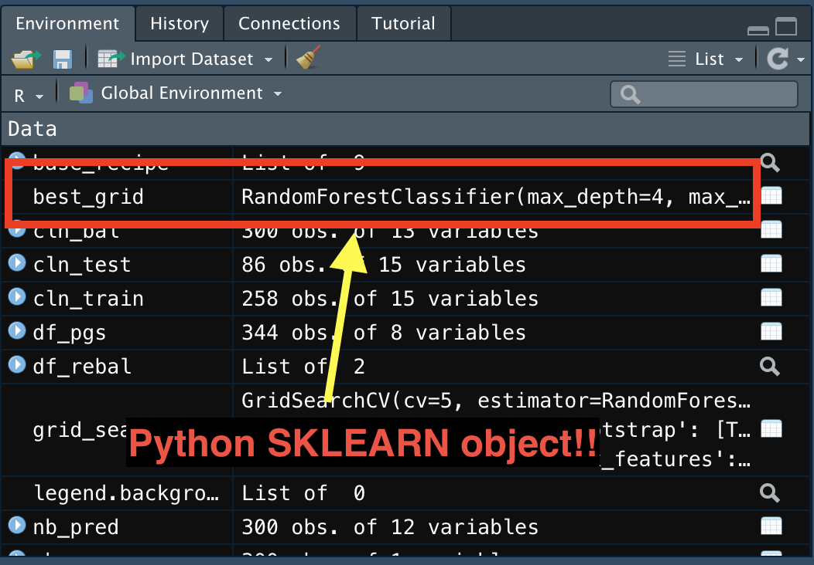
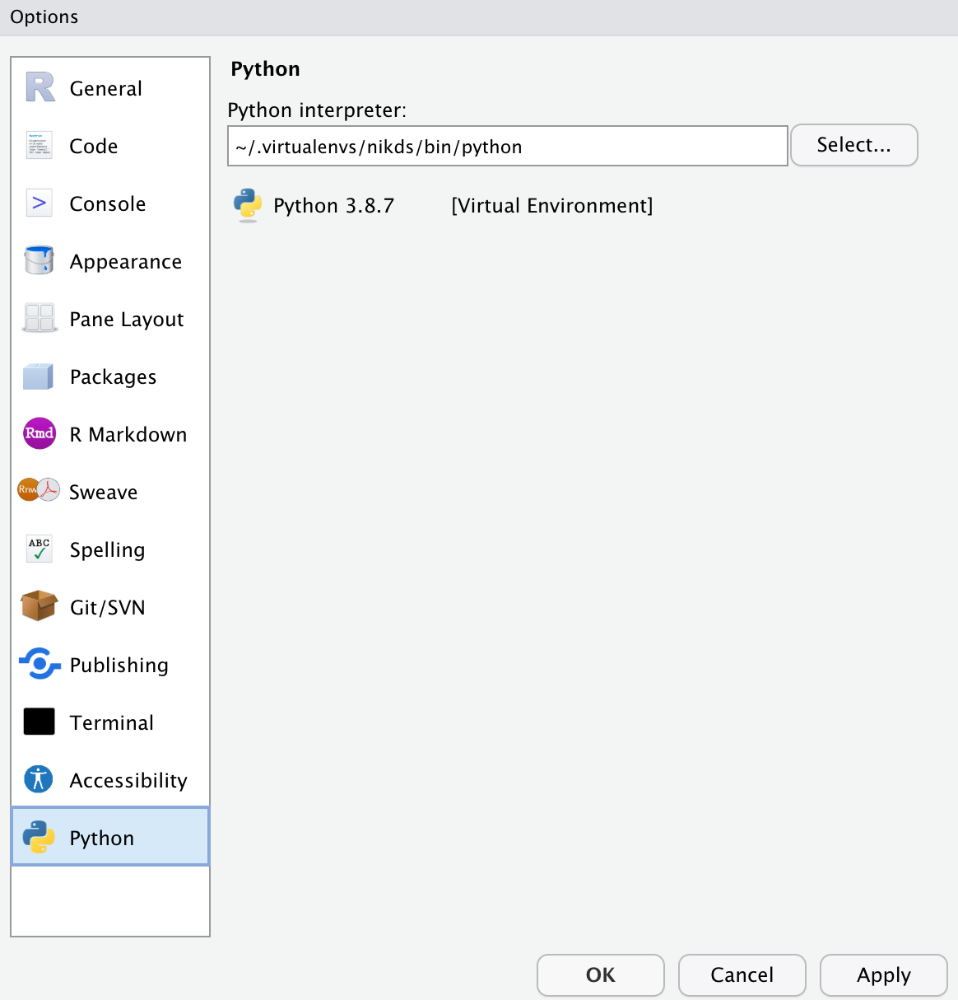

RStudio 1.4 was [released](https://blog.rstudio.com/2021/01/19/announcing-rstudio-1-4/) in early January (just before the 2021 RStudio Global conference) and it really is a game changer for me and, dare I say, other data scientists!

Perhaps the most significant update is the ability to display Python objects right in the Environment tab of the RStudio IDE (see below):

### So why is this a big deal?

This new RStudio update is major news since I can now leverage the best of both worlds in one IDE far more easily. Let me list it out:

- I can use {reticulate} to execute code in Python using R syntax - available prior to RStudio 1.4
- I can run .py files (Python scripts) within RStudio and not have to use VSCode (my second favorite text-editor/IDE)

### Here's where I'm coming from

In my current role, I code in both Python and R and have to use different IDEs (VSCode and RStudio respectively). From my experience, I find certain things to be easier to do in Python and many other things far more easier to do in R. I have to say that matplotlib is by far the WORST Python library I've ever used^[It's my opinion. Don't @ me]. On the other hand, {ggplot2} is simply a gorgeous library that makes plotting exceptionally easy and fun. And let me tell you that data wrangling with {dplyr} is far more intuitive than pandas^[Why does pandas have more than 1 way to do things? The entire syntax in pandas is ugly and hard to read]. However, where Python really shines is the sklearn library. What I really enjoy about the sklearn library is the fact that it can do parallel processing right out of the box without me having to load (or figure out) what other libraries I need. Alas, the syntax for {tidymodels} is far more intuitive.

### The game changing fix

Prior to RStudio 1.4, it was kind of a pain to use {reticulate} or run Python scripts. The biggest challenge was not really being able to see what Python objects were loaded into memory if running a Python script. Furthermore, it was annoying (to me) to have to define the virtual environment (or conda environment) to use with {reticulate}^[you'd have to use `reticulate::use_virtualenv(<path>)` prior to loading any Python objects into R]. Now you can just define the path to your favored virtual environment right in the Global Options menu:

By defining the virutal environment path, running {reticulate} or Python scripts is far more easier!

### How I'm Using It

Since its release, I've been fervently using RStudio as my defacto IDE for both R and Python scripts. I'm still not letting go of VSCode; that software has quite a bit of flexibility beyond just being an IDE. However, with the ability of running Python scripts AND seeing the objects in the Environment tab, it makes my adventures in Data Science at work far more productive. Also, this new version has encouraged me to revisit {reticulate}. My plan, going forward, is to integrate both R and Python functions into the same script so I can, basically, take advantage of both languages and be far more productive^[I don't have to bounce between 2 different IDEs anymore! YAY!].

